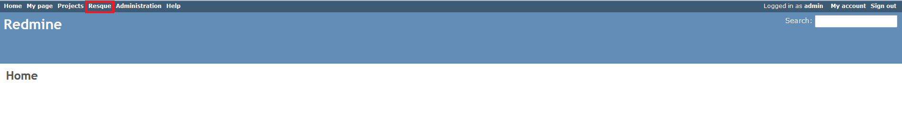
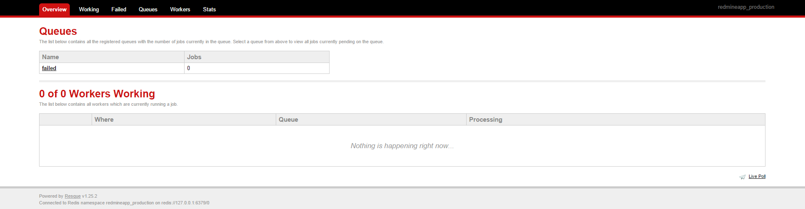

# Redmine Resque Plugin

This plugin adds **resque** and **resque-scheduler** gems (https://github.com/resque/resque) and mounts the Resque front end on the "/resque" subpath.

The plugin creates a top-menu Redmine link that allows the administrator to see what happens in the job queue.  

## Compatibility

This plugin version is compatible only with Redmine 2.1.x and later.

## Installation

1. This plugin requires Redis. Install and run the Redis service before you proceed.

2. To install the plugin
    * Download the .ZIP archive, extract files and copy the plugin directory into #{REDMINE_ROOT}/plugins.
    
    Or

    * Change you current directory to your Redmine root directory:  

            cd {REDMINE_ROOT}
            
      Copy the plugin from GitHub using the following commands:
      
            git clone https://github.com/Restream/redmine_resque.git plugins/redmine_resque
            
3. Install the required gems using the command:  

        bundle install

    * In case of bundle install errors, remove the Gemfile.lock file, update the local package index and install the required dependencies. Then execute the `bundle install` command again:  

            rm Gemfile.lock
            sudo apt-get update
            sudo apt-get install -y libxml2-dev libxslt-dev libpq-dev
            bundle install
            
4. Restart Redmine.

5. Run a Resque worker from the REDMINE_ROOT directory or use an [Ubuntu/Debian upstart job](#ubuntudebian-upstart-job):

        bundle exec rake resque:work RAILS_ENV=production QUEUE=*
        
6. Run a Resque scheduler from the REDMINE_ROOT directory or use an [Ubuntu/Debian upstart job](#ubuntudebian-upstart-job):

        bundle exec rake resque:scheduler RAILS_ENV=production

Now you should be able to see the plugin in **Administration > Plugins**.

## Scheduling the jobs

1. Create the worker schedule file in the **redmine/config** directory:

        nano config/worker_schedule.yml

2. Add the following configuration section to your schedule.

#### Mail reading

The parameters for this job are exactly the same as the normal Redmine rake task to receive emails with IMAP [as described here](http://www.redmine.org/projects/redmine/wiki/RedmineReceivingEmails).

        read_mail:
          cron: "* * * * *"
          class: "ReceiveEmailIMAP"
          queue: "mail"
          args:
          - host: imap.gmail.com
          - port: 993
          - ssl: true
          - username: some_user@gmail.com
          - password: some_password
          description: "Read mail sent to Redmine mailbox."

## Ubuntu/Debian upstart job

1. Copy the example upstart configuration files provided by this plugin to the system directory:

        cp script/redmine_*.conf /etc/init

2. Edit the configuration files and scripts to reflect the correct system user and Redmine installation path.

        nano script/redmine_scheduler.sh
        nano script/redmine_worker.sh
        nano /etc/init/redmine_scheduler.conf
        nano /etc/init/redmine_worker.conf

3. Start or stop the scheduler and the worker.

        service redmine_scheduler start
        service redmine_worker start

4. If you want non-root users to be able to stop/start the service, add them to the sudoers file:

        nano /etc/sudoers
        
        # Add these lines:
        your_user ALL=NOPASSWD: /usr/sbin/service redmine_scheduler *
        your_user ALL=NOPASSWD: /usr/sbin/service redmine_worker *

## Usage

This plugin is used by other Redmine plugins, for example, [Redmine Elastic Search Plugin](https://github.com/Restream/redmine_elasticsearch).

## Maintainers

Danil Tashkinov, [github.com/nodecarter](https://github.com/nodecarter)

## License

Copyright (c) 2016 Restream

Licensed under the Apache License, Version 2.0 (the "License");
you may not use this file except in compliance with the License.
You may obtain a copy of the License at

http://www.apache.org/licenses/LICENSE-2.0

Unless required by applicable law or agreed to in writing, software
distributed under the License is distributed on an "AS IS" BASIS,
WITHOUT WARRANTIES OR CONDITIONS OF ANY KIND, either express or implied.
See the License for the specific language governing permissions and
limitations under the License.
